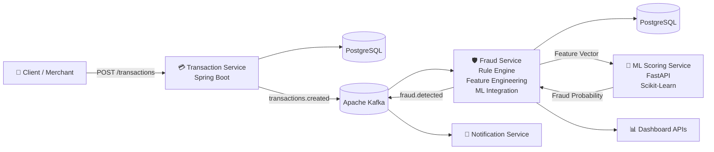
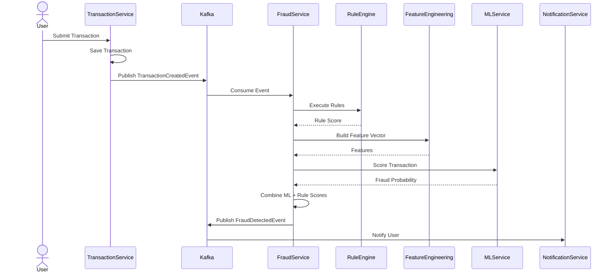

<div align="center">

# 🛡️ Fraud Detection Platform

### Real-Time Event-Driven Fraud Detection using **Spring Boot • Apache Kafka • FastAPI • Machine Learning**

*A production-inspired microservices platform that analyzes financial transactions in real time using configurable business rules and machine learning.*

<br>


---

> **"Detect fraud before it becomes financial loss."**

</div>

---

# 💡 Overview

Modern payment systems process millions of transactions every day. Detecting fraudulent activity requires more than static business rules—it demands scalable architectures capable of combining deterministic logic with intelligent prediction models.

This project demonstrates how modern financial institutions approach fraud detection using:

* Event-Driven Microservices
* Apache Kafka
* Dynamic Rule Engine
* Feature Engineering
* Machine Learning
* Distributed Processing

Instead of blocking transactions synchronously, the system processes them asynchronously through Kafka, evaluates fraud risk, enriches the transaction with behavioural features, invokes an ML scoring service, and publishes fraud decisions for downstream consumers.

---

# 🚀 Why This Project?

Traditional fraud systems often suffer from:

* Hardcoded business rules
* Tight coupling between services
* Poor scalability
* Limited behavioural analysis

This platform addresses those limitations by separating responsibilities into independent microservices and combining rule-based detection with machine learning.

---

# ✨ Key Highlights

| Capability             | Description                                   |
| ---------------------- | --------------------------------------------- |
| ⚡ Real-Time Processing | Kafka-based event streaming                   |
| 🛡 Dynamic Rule Engine | Rules configurable from the database          |
| 🤖 Machine Learning    | Python FastAPI scoring service                |
| 📈 Feature Engineering | Behavioural feature generation                |
| 🏗 Microservices       | Independent, loosely coupled services         |
| 📨 Notifications       | Fraud events published for downstream systems |
| 📊 Analytics           | Dashboard APIs for monitoring fraud trends    |
| 🐳 Dockerized          | Local infrastructure with Docker Compose      |

---

# 🏛 System Architecture

> Event-driven microservices communicating asynchronously through Apache Kafka.



# 🔄 Transaction Flow



Kafka->>NotificationService: Notify User
---

# 📂 Project Structure

```text
fraud-detection-platform
│
├── common-lib
│
├── transaction-service
│     ├── REST APIs
│     ├── Transaction Persistence
│     └── Kafka Producer
│
├── fraud-service
│     ├── Rule Engine
│     ├── Feature Engineering
│     ├── ML Integration
│     ├── Dashboard APIs
│     └── Kafka Consumer
│
├── notification-service
│     └── Kafka Consumer
│
├── ml-scoring-service
│     ├── FastAPI
│     └── Machine Learning Model
│
├── docker-compose.yml
└── README.md
```

---

# 🔄 Transaction Lifecycle

```text
                Client
                   │
                   ▼
        Transaction Service
                   │
             Save Transaction
                   │
                   ▼
          Kafka (transactions.created)
                   │
                   ▼
            Fraud Service
          ┌──────────────────┐
          │ Rule Engine       │
          │ Feature Builder   │
          │ ML Scoring        │
          └──────────────────┘
                   │
                   ▼
         Fraud Analysis Result
                   │
          Kafka (fraud.detected)
                   │
                   ▼
        Notification Service
```

---

# 🧩 Microservices

## 💳 Transaction Service

Responsible for:

* Accepting transaction requests
* Persisting transactions
* Publishing Kafka events

---

## 🛡 Fraud Service

Core intelligence of the platform.

Responsibilities:

* Rule Evaluation
* Behaviour Analysis
* Feature Engineering
* ML Integration
* Fraud Dashboard APIs
* Dynamic Rule Configuration

---

## 📨 Notification Service

Consumes fraud events and represents downstream notification systems such as:

* Email
* SMS
* Push Notifications

---

## 🤖 ML Scoring Service

Python FastAPI microservice responsible for:

* Feature preprocessing
* Fraud probability prediction
* Model inference

---

# 📈 Feature Engineering

Before invoking the ML model, the Fraud Service derives behavioural features such as:

| Feature                | Purpose            |
| ---------------------- | ------------------ |
| Amount                 | Transaction size   |
| Country                | Geographical risk  |
| Merchant Category      | Merchant behaviour |
| Payment Method         | Payment risk       |
| Transactions Last Hour | Velocity detection |
| New Device             | Device anomaly     |

---

# 🛡 Rule Engine

Current implemented rules include:

* High Amount Rule
* High Velocity Rule
* High Risk Country Rule
* New Device Rule

The rules are database-driven, allowing thresholds to be modified without redeploying the application.

---

# 🤖 Machine Learning Integration

The Fraud Service communicates with a dedicated FastAPI service to obtain fraud predictions.

The ML score is combined with the rule engine score to produce the final fraud decision.

```text
Rule Score
      │
      ▼

Machine Learning Score

      │
      ▼

Combined Fraud Decision
```

---

# 🛠 Technology Stack

| Layer            | Technologies          |
| ---------------- | --------------------- |
| Language         | Java 25, Python       |
| Framework        | Spring Boot           |
| Messaging        | Apache Kafka          |
| Database         | PostgreSQL            |
| ORM              | Spring Data JPA       |
| Machine Learning | FastAPI, Scikit-learn |
| Build Tool       | Maven                 |
| Infrastructure   | Docker Compose        |
| Monitoring       | Kafka UI, pgAdmin     |

---

# ▶️ Running the Project

### Start Infrastructure

```bash
docker compose up -d
```

### Start Services

```bash
cd transaction-service
mvn spring-boot:run
```

```bash
cd fraud-service
mvn spring-boot:run
```

```bash
cd notification-service
mvn spring-boot:run
```

```bash
cd ml-scoring-service

source .venv/bin/activate

uvicorn app.main:app --reload
```

---

# 🧪 Sample Transaction

```json
{
  "userId":"11111111-1111-1111-1111-111111111111",
  "merchantId":"22222222-2222-2222-2222-222222222222",
  "amount":150000,
  "currency":"INR",
  "merchantName":"Crypto Exchange",
  "merchantCategory":"CRYPTO",
  "country":"Nigeria",
  "paymentMethod":"CARD",
  "deviceId":"iphone-16-pro",
  "status":"PENDING"
}
```

---

# 📌 Engineering Principles

* Loose Coupling
* Event-Driven Communication
* Domain Separation
* Independent Scalability
* Database per Service
* Configurable Business Rules
* Production-Inspired Design

---

# 🛣 Future Roadmap

## Platform

* [ ] API Gateway
* [ ] JWT Authentication
* [ ] Role-Based Access Control
* [ ] Kubernetes Deployment
* [ ] GitHub Actions CI/CD
* [ ] Prometheus Monitoring
* [ ] Grafana Dashboards
* [ ] Distributed Tracing

## Machine Learning

* [ ] XGBoost Model
* [ ] Isolation Forest
* [ ] SHAP Explainability
* [ ] Continuous Model Retraining

## Fraud Detection

* [ ] User Behaviour Profiling
* [ ] Device Fingerprinting
* [ ] Merchant Reputation
* [ ] Adaptive Risk Thresholds
* [ ] Geo-Velocity Detection
* [ ] Graph-Based Fraud Detection

---

# 🎯 Skills Demonstrated

* Event-Driven Architecture
* Distributed Systems
* Spring Boot Microservices
* Apache Kafka
* PostgreSQL
* Docker
* REST APIs
* Machine Learning Integration
* Feature Engineering
* Rule Engine Design
* Clean Architecture
* Domain-Driven Design Concepts

---

<div align="center">

### ⭐ Thank You!

**Built to explore scalable backend engineering and real-time fraud detection using modern distributed systems.**

</div>
